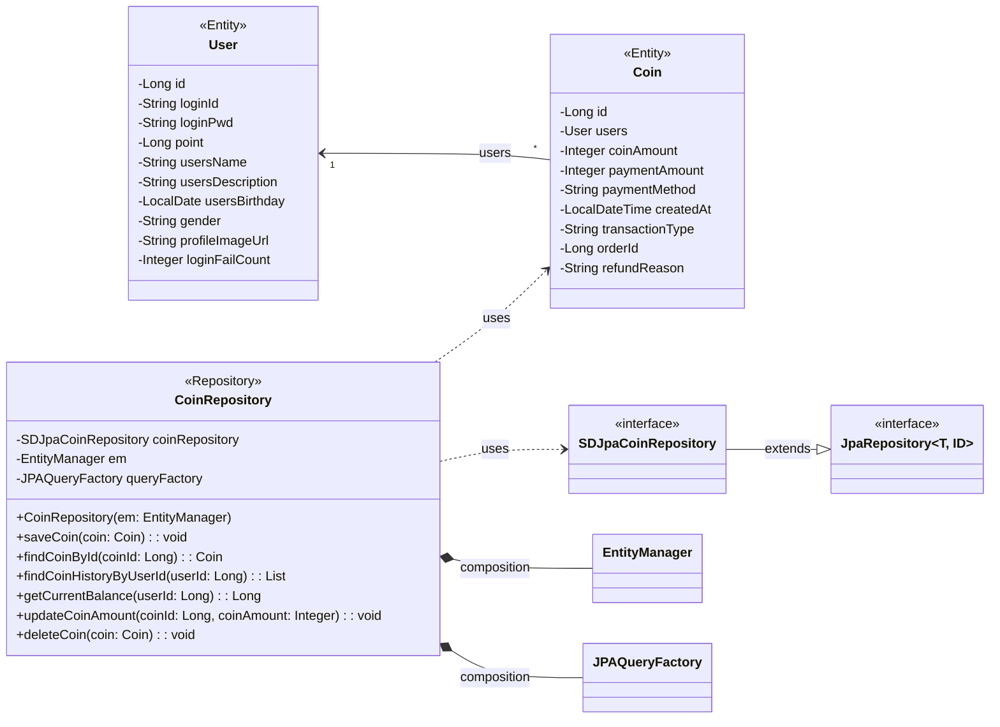

## coin class diagram

## CoinRepository 클래스 정보

| 구분             | Name                   | Type                | Visibility | Description                                   |
|:---------------|:-----------------------|:--------------------|:-----------|:----------------------------------------------|
| **class**      | **CoinRepository**     |                     |            | 코인 충전, 사용, 환불, 내역 조회를 위한 Repository          |
| **Attributes** | coinRepository         | SDJpaCoinRepository | private    | 생성, 수정, 삭제, 조회 쿼리를 쉽게 사용하기 위한 Spring Data JPA |
|                | em                     | EntityManager       | private    | 엔티티 객체를 관리해주는 객체                              |
|                | queryFactory           | JPAQueryFactory     | private    | Query DSL 기능을 사용하기 위한 객체                      |
| **Operations** | CoinRepository         | void                | public     | CoinRepository 클래스 생성 및 초기화하는 생성자             |
|                | saveCoin               | void                | public     | 코인 충전, 사용, 환불 시 코인 정보를 DB에 저장하는 함수           |
|                | findCoinById           | Coin                | public     | 코인 ID로 코인 정보를 조회하는 함수                         |
|                | findCoinHistoryByUserId| List<Coin>          | public     | 사용자 ID로 코인 충전/사용/환불 내역을 조회하는 함수              |
|                | getCurrentBalance      | Long                | public     | 사용자의 현재 코인 잔액을 계산하여 반환하는 함수                   |
|                | updateCoinAmount       | void                | public     | 코인 금액을 수정하는 함수                                |
|                | deleteCoin             | void                | public     | 코인 정보를 DB에서 삭제하는 함수                           |

## Coin Entity 정보

| 구분             | Name            | Type           | Description                                      |
|:---------------|:----------------|:---------------|:-------------------------------------------------|
| **Attributes** | id              | Long           | 코인 고유 ID (Primary Key)                          |
|                | users           | User           | 코인을 소유한 사용자 (Foreign Key)                       |
|                | coinAmount      | Integer        | 코인 금액 (충전: +, 사용: -, 환불: +)                     |
|                | paymentAmount   | Integer        | 실제 결제 금액 (충전 시에만 사용)                            |
|                | paymentMethod   | String         | 결제 수단 (카드, 계좌이체, 카카오페이 등)                        |
|                | createdAt       | LocalDateTime  | 거래 발생 시각                                         |
|                | transactionType | String         | 거래 타입 (CHARGE: 충전, USE: 사용, REFUND: 환불)         |
|                | orderId         | Long           | 주문 번호 (코인 사용 시)                                  |
|                | refundReason    | String         | 환불 사유 (환불 시)                                     |