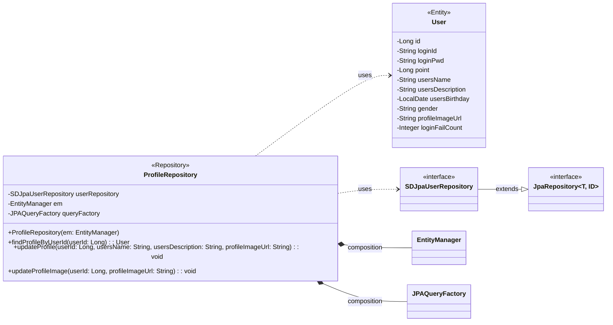

## profile class diagram

## ProfileRepository 클래스 정보

| 구분             | Name                | Type                | Visibility | Description                                   |
|:---------------|:--------------------|:--------------------|:-----------|:----------------------------------------------|
| **class**      | **ProfileRepository** |                     |            | 사용자 프로필 조회 및 수정을 위한 Repository               |
| **Attributes** | userRepository      | SDJpaUserRepository | private    | 생성, 수정, 삭제, 조회 쿼리를 쉽게 사용하기 위한 Spring Data JPA |
|                | em                  | EntityManager       | private    | 엔티티 객체를 관리해주는 객체                              |
|                | queryFactory        | JPAQueryFactory     | private    | Query DSL 기능을 사용하기 위한 객체                      |
| **Operations** | ProfileRepository   | void                | public     | ProfileRepository 클래스 생성 및 초기화하는 생성자          |
|                | findProfileByUserId | User                | public     | 사용자 ID로 프로필 정보를 조회하는 함수                      |
|                | updateProfile       | void                | public     | 닉네임, 자기소개, 프로필 이미지를 수정하는 함수                   |
|                | updateProfileImage  | void                | public     | 프로필 이미지만 수정하는 함수                              |