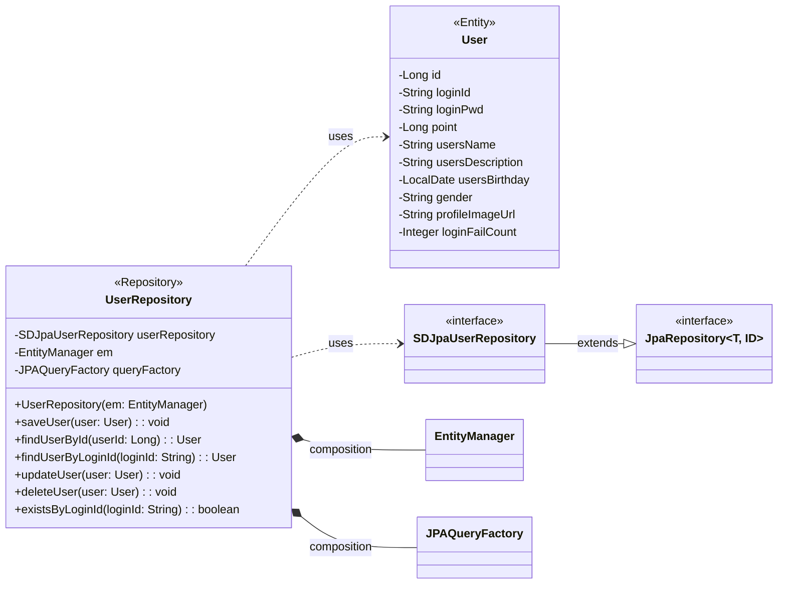

## user class diagram

## UserRepository 클래스 정보

| 구분             | Name               | Type                | Visibility | Description                                   |
|:---------------|:-------------------|:--------------------|:-----------|:----------------------------------------------|
| **class**      | **UserRepository** |                     |            | 회원가입, 로그인, 로그아웃, 프로필 관리를 위한 사용자 정보 Repository |
| **Attributes** | userRepository     | SDJpaUserRepository | private    | 생성, 수정, 삭제, 조회 쿼리를 쉽게 사용하기 위한 Spring Data JPA |
|                | em                 | EntityManager       | private    | 엔티티 객체를 관리해주는 객체                              |
|                | queryFactory       | JPAQueryFactory     | private    | Query DSL 기능을 사용하기 위한 객체                      |
| **Operations** | UserRepository     | void                | public     | UserRepository 클래스 생성 및 초기화하는 생성자             |
|                | saveUser           | void                | public     | 회원가입 시 사용자 정보를 DB에 저장하는 함수                    |
|                | findUserById       | User                | public     | 사용자 ID로 사용자 정보를 조회하는 함수                       |
|                | findUserByLoginId  | User                | public     | 로그인 ID로 사용자 정보를 조회하는 함수 (로그인 시 사용)           |
|                | updateUser         | void                | public     | 프로필 수정 시 사용자 정보를 업데이트하는 함수                    |
|                | deleteUser         | void                | public     | 사용자 정보를 DB에서 삭제하는 함수 (회원탈퇴)                   |
|                | existsByLoginId    | boolean             | public     | 회원가입 시 로그인 ID 중복 확인을 위한 함수                    |